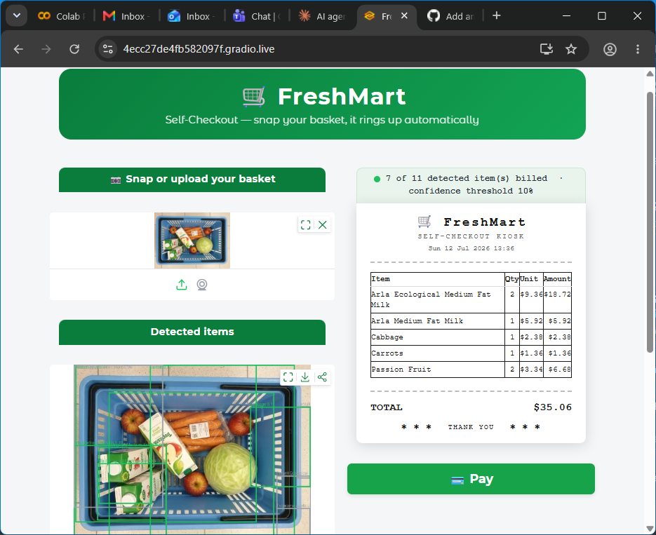
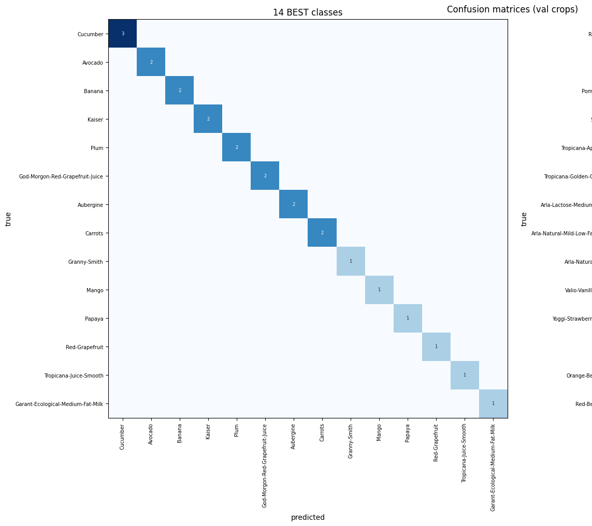
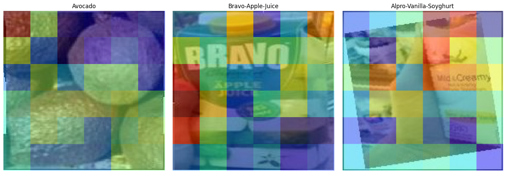

# 🛒 Computer Vision Cart Checkout

*An end-to-end vision self-checkout: photograph a basket of groceries, and the system detects each item, recognizes what it is, matches it to a product catalog, and totals the bill.*

<!-- ============================================================= -->
<!--  APP SCREENSHOT — replace the placeholder below with a real   -->
<!--  screenshot of the Gradio kiosk (detected boxes + basket).    -->
<!-- ============================================================= -->



> Gradio app showing an uploaded basket photo with detection boxes, the recognized item list, and the running total._

---

## Description & Background

Can a single photo of a mixed basket become an itemized bill, with no barcodes? This project is built on the [**GroceryStoreDataset**](https://github.com/marcusklasson/GroceryStoreDataset) — 81 fine-grained products across 43 coarse categories and 3 types (Fruit, Vegetables, Packages). Crucially, the dataset is **classification-only**: class labels but **no bounding boxes**.

That gap drives the design. The pipeline **manufactures** bounding boxes from label-only data, **composes** multi-item scenes to train a detector, then splits the problem in two: a detector that finds *where* products are, and a recognizer that decides *what* each one is. It runs as a **five-step Colab notebook** that checkpoints to Google Drive, so any step can be run and resumed independently.

```
Photo → [Detect: where?] → crop → [Recognize: what?] → [Catalog match] → [Price lookup] → Basket total
```

**Why the split matters:** training one detector to do fine-grained 81-class recognition on ~30 images/class localizes poorly. Collapsing detection to a **single `product` class** and handing classification to a dedicated recognizer is the core decision that makes it work.

---

## ML concepts employed

**Core techniques**
- **Two-stage detection → recognition** — a single-class object detector for localization, decoupled from a fine-grained classifier for identification.
- **Transfer learning on frozen features** — a self-supervised **DINOv2** backbone used off-the-shelf; only a lightweight linear head is trained on top.
- **Backbone benchmarking** — DINOv2 embeddings vs. the YOLO11 backbone's pooled features are trained and scored head-to-head, and the winner is kept automatically.
- **Embedding-based catalog retrieval** — nearest-neighbor cosine matching of crops against a gallery of L2-normalized product embeddings.
- **Model diagnosis before deployment** — per-class accuracy, a confusion matrix, and **occlusion-sensitivity explanation heatmaps** to confirm the model attends to the product, not the background.

**Fine-tuning**
- **YOLO11 fine-tuned** from pretrained weights as a single-class `product` detector on composed scenes.
- **Linear-probe training** of the recognizer head on frozen embeddings (fast, hard to overfit on limited data).
- **Conditional retraining** — the detector is re-tuned after augmentation and the new weights are **kept only if validation mAP improves**.

**Augmentation**
- **Synthetic scene composition** — accepted single-item crops are pasted into multi-item, multi-class canvases with **proportionally-scaled bounding boxes**, so the detector trains on the cluttered-basket distribution it will actually face.
- **Auto-boxing with an accept/reject gate** — candidate boxes are filtered by area sanity (reject slivers and near-full-frame), focus (Laplacian-variance floor), and centrality; images that fail the gate are **discarded** rather than allowed to pollute training.
- **cGAN weak-class augmentation** — a **class-conditioned GAN** generates additional synthetic samples for the weakest SKUs identified in diagnosis, which are then composed into fresh training scenes. (Copy-paste augmentation was tried first and gave no lift, so it was replaced by the cGAN.)

---

## Technologies used

**Models**
- **YOLO11** (Ultralytics) — single-class product detector.
- **DINOv2 ViT-S/14** (Meta AI, frozen) — feature backbone for the recognizer and catalog gallery.
- **Conditional GAN (cGAN)** — custom compact generator/discriminator for weak-class augmentation.
- **Linear recognizer head** — softmax classifier over 81 fine classes on frozen features.

**Data**
- [**GroceryStoreDataset**](https://github.com/marcusklasson/GroceryStoreDataset) — 81 fine classes / 43 coarse / 3 types; 81 iconic catalog images; classification labels only (boxes are generated in-pipeline).

**Frameworks & libraries**
- **PyTorch** / **TorchVision** — model training and feature extraction.
- **Ultralytics** — YOLO11 training and inference.
- **OpenCV** — auto-boxing (GrabCut fallback, sharpness scoring).
- **scikit-learn** — evaluation metrics.
- **NumPy / pandas / Matplotlib** — data handling and diagnostic plots.
- **Pillow (PIL)** — image compositing.

**Environment & Demo**
- **Google Colab** (GPU / T4 recommended) — training environment.
- **Google Drive** — cross-step checkpoint bundle (labels table, embeddings, prices, detector/recognizer weights).
- **Gradio** — interactive self-checkout web app, with a **QR code** to open the kiosk on a phone.

---

## Results snapshot

_Numbers and figures below are extracted from an actual notebook run (defaults, T4 GPU). They reflect a quick end-to-end pass — raise the speed knobs for higher-quality results._

**Detector (YOLO11, single `product` class), on held-out composed scenes:**

| Stage | mAP@50 | mAP@50-95 |
|-------|:------:|:---------:|
| Step 2 — initial fine-tune | 0.53 | 0.48 |
| Step 4 — after cGAN weak-class augmentation | **0.995** | **0.981** |

The Step 4 before/after check confirmed the lift (`mAP50 0.991 → 0.995`, `mAP50-95 0.951 → 0.981`), so the re-tuned weights were kept.

**Recognizer backbone benchmark (linear head on frozen features, val crops):**

| Backbone | Accuracy | Macro AP |
|----------|:--------:|:--------:|
| **DINOv2 ViT-S/14** (winner) | **0.40** | **0.57** |
| YOLO11 backbone features | 0.01 | 0.05 |

DINOv2 wins decisively and is saved as the recognizer's feature source. The modest absolute accuracy reflects the genuinely hard part of the task — 81 fine-grained classes with very few crops each — which is exactly what the diagnosis below is for.

**Per-class diagnosis — confusion matrix (best vs. worst classes):**



Clean produce (Cucumber, Avocado, Banana, Aubergine) is recognized reliably; the weakest classes are low-support SKUs and visually similar packaged goods (e.g. milk/yoghurt cartons confused with each other).

**Explanation heatmap (does the recognizer look at the product, not the background?):**



An occlusion-sensitivity map over sample crops — warmer regions are where hiding the image hurts the predicted class most. Attention concentrated on the product itself (not a hand or background clutter) is the pass condition; this is the check that catches a model quietly "cheating" on shortcut cues.

---

## Instructions to use

**Prerequisites**
- A Google account (for Colab + Drive).
- A Colab **GPU runtime**: `Runtime → Change runtime type → T4 GPU`.

**Run the pipeline**
1. Open `cv_cart_checkout.ipynb` in Google Colab.
2. Run **Step 1 → Step 5 in order.** The first cell installs dependencies and mounts Google Drive (grant access when prompted). The dataset is cloned automatically.
3. Each step **saves a checkpoint** to `MyDrive/CvCart/`, so you can stop after any step and resume later — even in a fresh runtime — because every step reloads the previous checkpoint at its start.
4. **Step 5** launches the Gradio app. Open the public link (or scan the QR code), upload a photo of several grocery items, and read off the itemized basket and total.

**Speed knobs (environment variables, optional)**
The notebook ships with modest defaults so a first end-to-end pass finishes quickly. Raise these for higher quality:

| Variable | Controls | Default |
|----------|----------|---------|
| `CVCART_PER_CLASS` | source images boxed per class | 25 |
| `CVCART_SCENES` | composed training scenes | 120 |
| `CVCART_EPOCHS` / `CVCART_EPOCHS2` | detector training epochs (Step 2 / Step 4) | 40 |
| `CVCART_IMGSZ` | detector input size | 640 |
| `CVCART_GAN_STEPS` | cGAN training iterations | 600 |
| `CVCART_GEN_PER_CLASS` | synthetic crops per weak class | 24 |

---

## Things to note

- **All bounding boxes are manufactured** by Step 2's auto-boxer, so reported **mAP measures agreement with the auto-boxer, not true ground truth.** Run the optional **Step 2.6 gold-set evaluation** for one trustworthy number.
- **The detector trains on composed synthetic scenes** and is **single-class** (localization only) — real uploads with heavy occlusion or odd angles will score lower, and fine-grained 81-class identification remains the recognizer's hardest job.
- **cGAN samples are low-resolution (64px)**; a lift isn't guaranteed, so retrained weights are kept only if Step 4.2's before/after mAP improves.
- **Prices are randomly generated** (seeded) — a technical demo, not a real price list.
- **Improvement priority:** better / hand-checked boxes → more realistic scenes → stronger recognizer backbone → targeted weak-class data.

---

## Acknowledgements

- **GroceryStoreDataset** — M. Klasson, C. Zhang, H. Kjellström. *A Hierarchical Grocery Store Image Dataset with Visual and Semantic Labels.* ([repo](https://github.com/marcusklasson/GroceryStoreDataset))
- **DINOv2** — Meta AI Research.
- **YOLO11** — Ultralytics.
